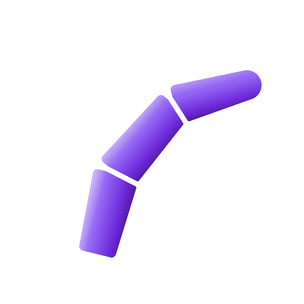
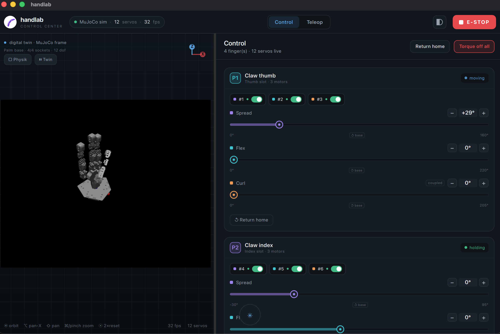
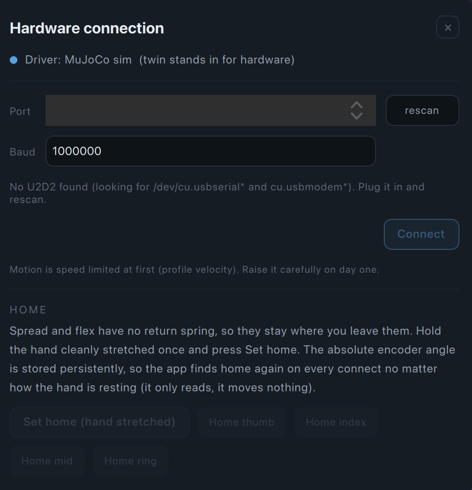
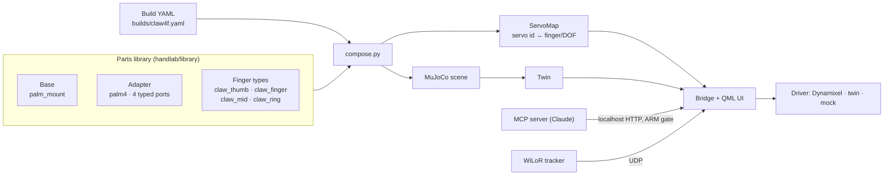

<div align="center">



# handlab

**A config-driven control center and live MuJoCo digital twin for tendon-driven robotic hands.**


<!-- TODO(michael): replace with real footage at docs/media/hero.gif (hand + twin moving together) -->


<sub>The <b>Control</b> tab: the live MuJoCo twin of the 4-finger hand (left) next to one card per finger,
with per-servo torque switches and a slider per DOF (right). The top bar shows the active driver,
servo count and render rate.</sub>

</div>

---

## What it does

- **Control center** — one native desktop app (Python + PySide6/QML). Per-DOF sliders drive the
  servos, with per-servo torque, live current/temperature, editable joint limits, saved poses and
  recorded motion clips, and a persistent absolute-encoder home.
- **Live MuJoCo digital twin** — the hand is composed from its parts into one MuJoCo scene and
  rendered live next to the controls. Without hardware, the twin *is* the hardware; a physics
  mode adds gravity, collisions and a test object to grasp.
  > ⚠️ **Placeholder model.** The current twin geometry is a stand-in with known bugs.
  > **TODO:** a simplified twin model made specifically for the app.
- **WiLoR hand-tracking teleop** — hold your hand in front of a camera and the robot hand mirrors
  it. The tracker runs as a separate process and streams per-finger targets over UDP into the
  same clamped, E-STOP-guarded path the sliders use.
- **ArUco marker tracking** — marker poses in the hand frame (palm-base marker = reference),
  used to verify grasps; plus a standalone tool that measures a finger joint angle from two markers.
- **MCP agent layer** — Claude can drive the hand through an MCP server (`get_state`, `snapshot`,
  `detect_markers`, `set_dof`, `apply_pose`, `safe_home`, `estop`, …) in perceive → act → observe
  cycles. **Safety invariant: only a human can arm the hand; the MCP client can only disarm.**
- **Demo recorder** — synchronized camera image, action, proprioception and object pose episodes
  for imitation learning.

## Supported hardware

- Tendon-driven hands built as **fixed base → adapter → typed finger slots** (see below);
  each finger has 3 servos → 3 DOFs (`spread`, `flex`, coupled `curl`).
- **Dynamixel XL330** servos (XL330-M288-T) on a **U2D2** USB interface, Protocol 2.0.
- CAD, photos and build material live in a separate hardware repo
  <!-- TODO(michael): link once published --> (`handlab-hardware`, coming soon).

No hardware? Everything runs against the MuJoCo twin.

## Quickstart

Requirements: **macOS** (tested on Apple Silicon; the twin renders offscreen with
`MUJOCO_GL=cgl`, so other platforms are untested) and **Python 3.12**.

```bash
git clone https://github.com/michiqn/handlab.git
cd handlab
python3.12 -m venv .venv
.venv/bin/pip install -e '.[dev]'

.venv/bin/python -m handlab        # run the app (default build: claw4f, against the twin)
.venv/bin/python -m pytest         # run the tests
```

Optional extras:

```bash
.venv/bin/pip install -e '.[hardware]'   # real Dynamixel servos (dynamixel-sdk)
.venv/bin/pip install -e '.[agent]'      # the MCP server for Claude
.venv/bin/pip install -e '.[vision]'     # ArUco detection on the camera feed (OpenCV)
```

`HANDLAB_BUILD=claw3f .venv/bin/python -m handlab` boots the 3-finger build instead.

## Using it

### Simulation

Without hardware, the app drives the MuJoCo twin as if it were the hand: every slider, pose, clip,
teleop target and agent command moves the twin. **Physics** (top left of the viewport) switches on
gravity and collisions; **Drop** then drops a test object to grasp.

### Real hardware



Click the status chip in the top bar to open the connection dialog: pick the U2D2 port, connect,
and the twin starts mirroring the real servos.

1. **Set home once** — hold the hand stretched and press *Set home*. The absolute encoder angle is
   stored, so home is recovered on every later connect from whatever pose the hand rests in.
2. **Check direction** — if a finger moves mirror-inverted to the twin, flip its direction (per
   servo, per finger or all) in the same dialog once connected.
3. **Set limits** — click the min/max value under a slider and type the joint's real limit;
   *base* resets it to the CAD range.

Torque stays **off** after connecting; you engage it deliberately. Calibration (home, direction,
limits) lives in `~/.handlab/` and survives reinstalls.

<br clear="right">

### Claude via MCP

With the app running, register the MCP server in Claude Code:

```bash
claude mcp add handlab -- "$PWD/.venv/bin/python" -m handlab.mcp_server
```

Then open the **Agent** panel (the floating bubble) and **arm** the hand. Claude can read the
state, take camera or twin snapshots, detect markers and move the hand in small observed steps.
It can never arm the hand itself.

### WiLoR teleop

The tracker needs its own venv and license-gated models: see [`tracking/README.md`](tracking/README.md).

### macOS app bundle

```bash
.venv/bin/pip install -e '.[package]'
.venv/bin/pyinstaller packaging/handlab.spec --noconfirm   # → dist/handlab.app
```

The camera works only from the bundled `.app` (it carries the macOS camera-permission entry).

## Safety by design

The hand is driven by a human, a tracker and an LLM — so the safety lives in one place, below all
of them:

- **One clamped motion path.** Sliders, poses, teleop and the agent all go through the same
  joint-range clamp and the driver's velocity, acceleration and current caps.
- **No surprise motion.** Torque is off after connect; enabling torque first sets goal = present
  position, so a servo never jumps; releasing the E-STOP never moves anything.
- **E-STOP** cuts torque on every servo, stops teleop and disarms the agent.
- **Human-only arming.** The agent API can disarm but has no way to arm; the gate is enforced in
  the app, not just in the MCP server.

## Architecture



## Project structure

```
handlab/            the app (Python package)
  library/          parts library: base, adapters, finger types (YAML + MJCF + meshes)
  builds/           build definitions (claw4f = 4 fingers, claw3f = 3 fingers)
  hal/              servo drivers: Dynamixel, MuJoCo twin-as-hardware, mock
  sim/              MuJoCo twin (step thread + offscreen renderer)
  ui/qml/           QML user interface
tracking/           WiLoR hand-tracking teleop (separate process + venv)
tools/              offline tools: CAD import, motor characterization, limits, markers, calibration
tests/              pytest suite
docs/media/         README images and demo footage
packaging/          PyInstaller spec for the macOS .app
```

## Status and roadmap

- ✅ **v1: 3-finger claw** (`claw3f`, 9 servos) running on real hardware, including the
  **first verified grasp** — confirmed by an ArUco marker on the object moving *with* the fingers.
- ✅ **v2: 4-finger hand** (`claw4f`, 12 servos, the default build) running on real hardware.
- 🚧 **Simplified twin model** — replace the placeholder twin geometry (known bugs) with a
  simplified model made for the app.

## How it was built

The software was largely written with [Claude Code](https://claude.com/claude-code). My role was
the architecture, the design decisions, testing, and building and verifying everything on the
real hardware.

## Credits

- **CRAFT hand** — L. Lin, S. Patel, J. Moon, S. Lazebnik, U. Jain (UIUC / UC Irvine).
  The claw finger models are derived from CRAFT ([github.com/craft-hand](https://github.com/craft-hand),
  MIT, see [`handlab/library/fingers/LICENSE-CRAFT`](handlab/library/fingers/LICENSE-CRAFT));
  palm and stand are my own design.
  ```bibtex
  @misc{lin2026crafttendondrivenhandhybrid,
    title={CRAFT: A Tendon-Driven Hand with Hybrid Hard-Soft Compliance},
    author={Leo Lin and Shivansh Patel and Jay Moon and Svetlana Lazebnik and Unnat Jain},
    year={2026}, eprint={2603.12120}, archivePrefix={arXiv}, primaryClass={cs.RO},
    url={https://arxiv.org/abs/2603.12120}
  }
  ```
- **ORCA Hand** by ORCA Dexterity, Inc. (ETH Zürich Soft Robotics Lab) — CC BY 4.0 — the
  ratchet-spool tendon tensioning ([orcahand_hardware](https://github.com/orcahand/orcahand_hardware),
  [arXiv:2504.04259](https://arxiv.org/abs/2504.04259)).
- **[WiLoR](https://github.com/rolpotamias/WiLoR)** (CC BY-NC-ND 4.0) via
  [WiLoR-mini](https://github.com/warmshao/WiLoR-mini), and the **MANO** hand model (non-commercial
  research license). Neither is included in this repo; each user obtains them under their own
  license — see [`tracking/README.md`](tracking/README.md).
- **[MuJoCo](https://github.com/google-deepmind/mujoco)** (Apache-2.0) — physics and rendering.
- **[ACDC4Robot](https://github.com/bionicdl-sustech/ACDC4Robot)** (MIT) — Fusion 360 → MJCF export.
- **PySide6 / Qt** (LGPL-3.0), **Dynamixel SDK** (Apache-2.0), **MCP Python SDK** (MIT),
  **OpenCV** (Apache-2.0).
- The handlab logo was generated with Google Gemini.

## License

<!-- TODO(michael): choose a license and add a LICENSE file -->
No license has been chosen yet. Third-party components keep their own licenses (see Credits).
